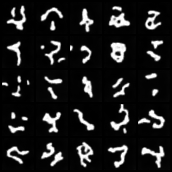
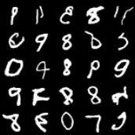
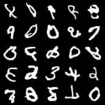
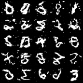

# DDPM and DDIM Implementation on MNIST

This project implements Denoising Diffusion Probabilistic Models (DDPM) and explores Denoising Diffusion Implicit Models (DDIM) for image generation on the MNIST dataset. This work is part of a machine learning course final report.

**GitHub Repository:** [git@github.com:allenshie/denoising-diffusion-pytorch-mnist.git](git@github.com:allenshie/denoising-diffusion-pytorch-mnist.git)
(For HTTPS access, use: `https://github.com/allenshie/denoising-diffusion-pytorch-mnist.git`)

## Table of Contents

- [Introduction](#introduction)
- [Features](#features)
- [Project Structure](#project-structure)
- [Setup](#setup)
  - [Environment](#environment)
  - [Prerequisites](#prerequisites)
  - [Installation](#installation)
  - [Data Preparation](#data-preparation)
- [Usage](#usage)
  - [Training the DDPM Model](#training-the-ddpm-model)
  - [Testing with Pre-trained Weights (Optional)](#testing-with-pre-trained-weights-optional)
  - [Inference and Comparison](#inference-and-comparison)
- [Results](#results)
  - [Training Samples](#training-samples)
  - [Generated Samples (Inference)](#generated-samples-inference)
  - [Performance Comparison](#performance-comparison)
- [Report](#report)
- [Future Work](#future-work)
- [Acknowledgements](#acknowledgements)
- [License](#license)

## Introduction

This project delves into the fascinating world of diffusion models, a powerful class of generative models. We implement a DDPM (leveraging the `denoising-diffusion-pytorch` library) to generate MNIST handwritten digits. Furthermore, we investigate the DDIM sampling strategy to accelerate image generation and compare its performance against the traditional DDPM sampling.

The primary goals of this project are:
- To understand the theoretical underpinnings of diffusion models.
- To gain hands-on experience in implementing and training a DDPM.
- To compare the characteristics of DDPM and DDIM sampling, focusing on generation quality and speed.

## Features

- DDPM model training on the MNIST dataset.
- U-Net architecture as the core denoising network.
- Support for standard DDPM sampling.
- Support for faster DDIM sampling with configurable steps and eta.
- Script for easy data preparation (downloading and structuring MNIST).
- Inference script (`inference_comparison_args.py`) to generate samples and compare DDPM/DDIM strategies.

## Project Structure

*(You can replace this with your actual tree output or keep the textual description as in the original message.)*

## Setup

### Environment

- **Operating System:** Linux (x86_64)
- **PyTorch Version:** 2.6.0 (or a compatible version)
- **CUDA Version:** 12.4

### Prerequisites

- Python 3.10+
- NVIDIA GPU with CUDA support

### Installation

1. Clone the repository:
```bash
git clone https://github.com/allenshie/denoising-diffusion-pytorch-mnist.git
cd denoising-diffusion-pytorch-mnist
```

2. Create a virtual environment:
```bash
python3 -m venv venv
source venv/bin/activate
```

3. Install PyTorch:
```bash
pip3 install torch torchvision torchaudio --index-url https://download.pytorch.org/whl/cu124 
```

4. Install dependencies:
```bash
pip3 install -r requirements.txt
```

### Data Preparation

```bash
python3 get_mnist_data.py
```

## Usage

### Training the DDPM Model

```bash
python3 train_ddpm_mnist.py
```

### Testing with Pre-trained Weights (Optional)

```bash
mkdir -p results_mnist_ddpm
# Place your model-X.pt file here
```

### Inference and Comparison

```bash
python3 inference_comparison.py --strategy ddpm --milestone 10
python3 inference_comparison.py --strategy ddim --milestone 10 --sample_steps 100 
```

## Results

### Training Samples
**Sample at 1st save (e.g., after 1000 training steps, corresponds to `sample-1.png`):**



 **Sample at 10th save (e.g., after 10000 training steps, corresponds to `sample-10.png`):**




### Generated Samples (Inference)

**DDPM Sampling (1000 steps) from Milestone 10 Weights:**



**DDIM Sampling (200 steps, eta=0.0) from Milestone 10 Weights:**




## Report

Refer to the final report for technical explanation and analysis.

## Future Work

- Extend to CIFAR-10 or CelebA datasets.
- Add image editing or class-conditional generation support.
- Explore medical imaging applications using diffusion models.

## Acknowledgements

- `denoising-diffusion-pytorch`
- MNIST dataset by Yann LeCun

